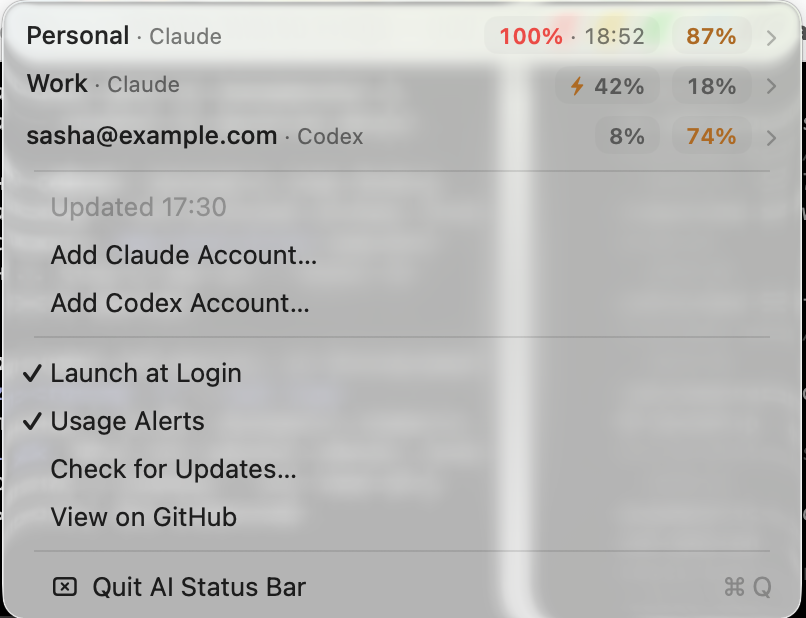

# Leeway

A menu bar app that shows how much usage you have left on multiple Claude accounts and Codex, at a glance.


<!-- TODO: add a real screenshot -->

## Install

```
brew install --cask sshykvlv/tap/leeway
```

Or download `Leeway.zip` from [Releases](https://github.com/sshykvlv/leeway/releases) and unzip it to `/Applications`.

## Usage

Your primary Claude Code account and Codex (`~/.codex`) are detected automatically — nothing to configure.

Add a second Claude account via **Add Claude Account…** in the menu — it opens a browser login, no cookie pasting.

The icon is a mini equalizer: one bar per account. The fill shows how much you have left, and a bar turns red once an account drops under 10% remaining.

## Privacy

All requests go directly from your Mac to Anthropic and OpenAI. No servers, no telemetry. OAuth tokens live only in your macOS Keychain; the Claude Code and Codex credentials are read locally, read-only.

## Credits

Thanks to [steipete/CodexBar](https://github.com/steipete/CodexBar) (MIT) whose docs documented the usage endpoints this app relies on.

## License

MIT — see [LICENSE](LICENSE).
